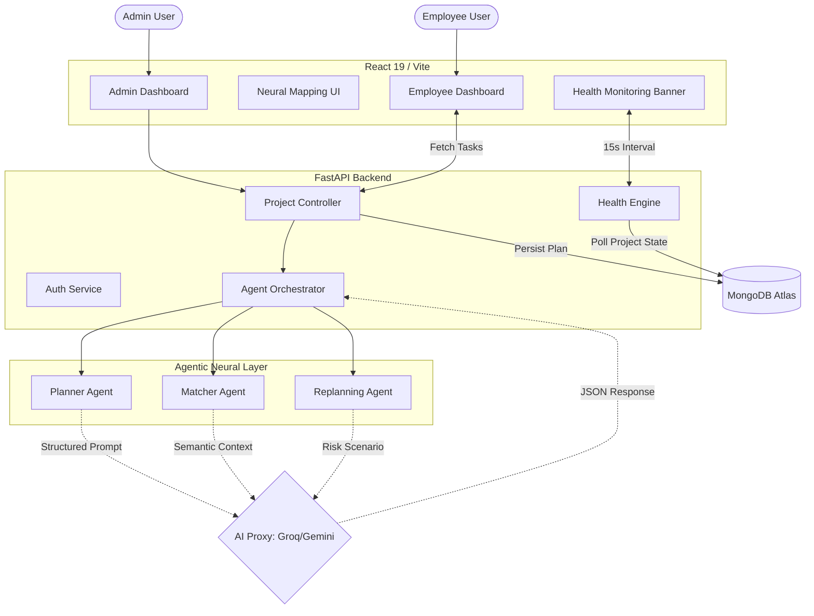

# NEXO: Full-Stack Project Architecture & Flowchart

This document provides a visual and structural representation of the NEXO ecosystem, from the user interface down to the agentic core and the database layer.

---

## 📊 1. System Architecture Flowchart (Mermaid)

NEXO uses a **Centralized Orchestration** model where the FastAPI backend acts as the brain, coordinating between the UI, the AI agents, and the persistent storage.

---

## 🔄 2. End-to-End Operational Lifecycle

### Phase 1: Project Initialization (The Neural Spark)
1.  **Input:** Admin provides a high-level project description and required expertise.
2.  **Decomposition:** The **Planner Agent** breaks the vision into exactly 10 sequential technical tasks.
3.  **Matching:** The **Matcher Agent** evaluates the global employee pool. It calculates scores based on semantic similarity between task requirements and employee skill vectors.

### Phase 2: Simulation & Commitment
1.  **Staging:** The results are shown in the **Neural Mapping UI**. No data is permanently changed yet.
2.  **Adjustment:** Admin can "Lock" employees or "Regenerate" the plan.
3.  **Finalization:** On "Confirm," the project moves from `draft` to `finalized`. Tasks are officially assigned to employee profiles in MongoDB.

### Phase 3: Execution & Monitoring (The Heartbeat)
1.  **Task Delivery:** Employees see their personalized technical briefings on their dashboards.
2.  **Status Sync:** As employees move tasks to "In Progress" or "Completed," the **Health Engine** tracks the delta.
3.  **Health Polling:** The frontend requests a health report every 15 seconds.
    *   **Formula:** `Expected Progress (Time Elapsed) vs. Actual Progress (Tasks Done) = Risk Score`.

### Phase 4: Autonomous Recovery (Self-Healing)
1.  **Trigger:** If `Risk Score > 50`, the UI displays a **Neural Intervention** alert.
2.  **Simulation:** The **Replanner Agent** triggers. It analyzes why the project is failing (e.g., Ananya is overloaded) and proposes a redistribute-and-recover plan.
3.  **Apply:** Admin clicks "Apply Neural Plan." The system reroutes tasks, sends notifications, and resets the project health metrics.

---

## 🛡️ 3. Security & Data Sovereignty
*   **Authentication:** JWT-based stateless auth.
*   **Authorization:** Role-Based Access Control (RBAC) ensuring employees cannot access Admin matching logic.
*   **Audit Trail:** Every agentic decision (Match Score, Reasoning, Replan Summary) is stored in the `projects` collection for transparency.

---
**NEXO: Where Human Intent meets Agentic Execution.**
